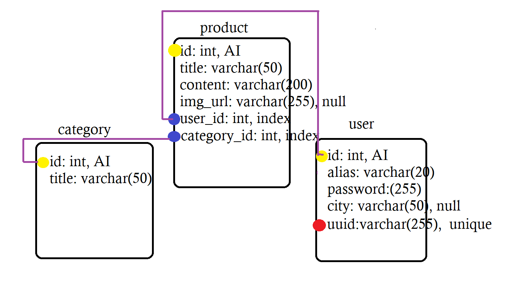
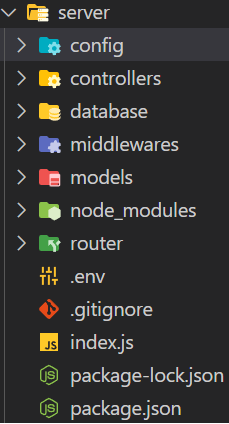

# chouff chouff pour le projet type le bon coin

- créer une appli' bdd - api back - react front
## BDD
    - tables
        - product
            - id / title / content / img_url / category_id / user_id
        - user
            - id / alias / password / city / uuid 
        - category
            - id / title

## api_back

- modules
    - nodemon (mode dev) <code>npm install nodemon -D</code>
    - <code>npm install express bcrypt mysql2 dotenv uuid</code>

- configuration du serveur
    - routeur API
    - variable d'environnement dans le fichier .env
    - structure MVC

- la view sera notre dossier client au même niveau que server, on adaptera plus tard pour l'intégrer dans notre "serveur"

- config : pour les variables (données réutilisables)
- controllers pour la logique, et la communication view <-> model
- database pour la connexion à la BDD
- middlewares pour gérer (plus tard) les routes nécessitant une authentification du token
- models pour les querys sur la bdd déclenchés par les fonctions du controller 
- router pour la mise en place de nos routes API
- .env contiendra nos information "confidentielles" tel que les infos de la BDD ou clé secrete pour le token (plus tard)
- index.js étant le point de départ de notre serveur

## mise place

- la BDD
- les routes
    - product
    - user (PS : à la création d'un user, il faut lui générer un uuid graçe au module)
- tester les routes sur postman

- la suite plus tard